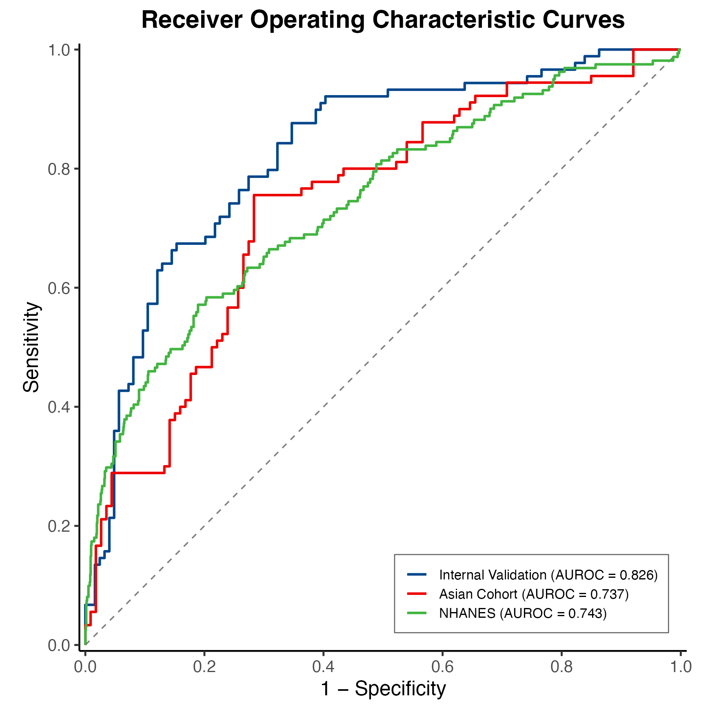
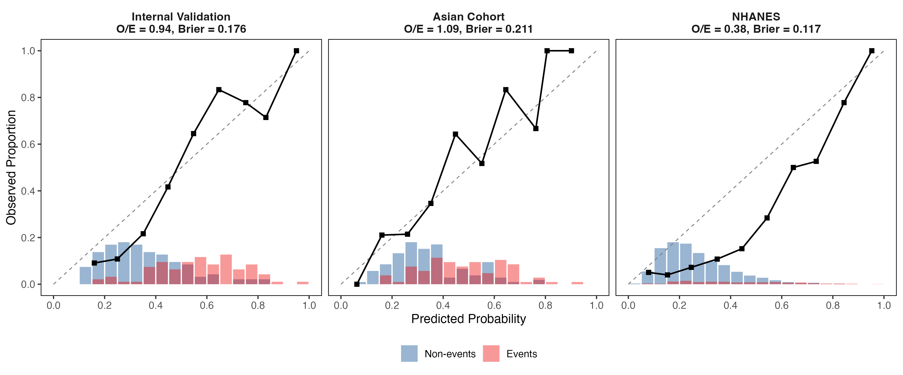
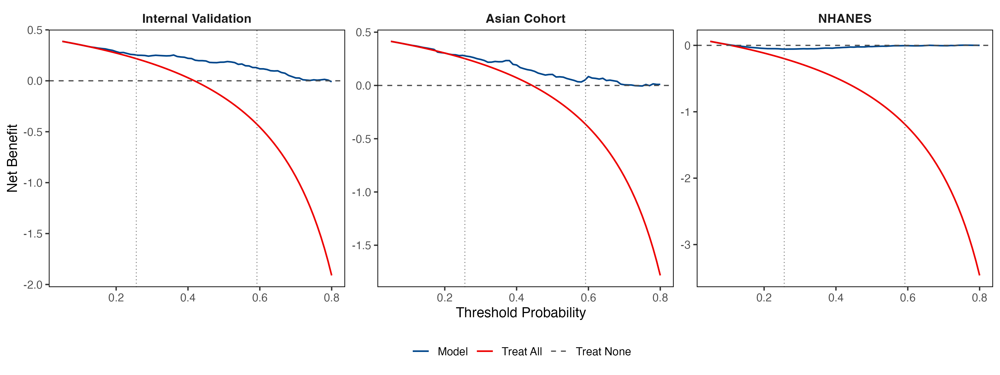

<p align="center">
  
</p>

<p align="center">
  <a href="https://laithomari.github.io/advanced_fibrosis_calculator/">
    
  </a>
  &nbsp;
  
  &nbsp;
  
  &nbsp;
  
</p>

<p align="center">
  <b>A validated, interpretable prediction model for advanced fibrosis risk stratification<br>in patients with indeterminate FIB-4 scores (1.3&ndash;2.67)</b>
</p>

---

## Overview

Approximately **25&ndash;35% of patients** with metabolic dysfunction-associated steatotic liver disease (MASLD) fall in the **indeterminate FIB-4 zone** (1.3&ndash;2.67), where current guidelines offer limited diagnostic guidance. This project presents a simple, laboratory-based logistic regression model that provides additional risk stratification using **10 routinely available clinical variables**.

<table>
<tr>
<td width="33%" align="center">
  <h3>0.819</h3>
  <sub>AUROC &mdash; Internal Validation</sub>
</td>
<td width="33%" align="center">
  <h3>0.740</h3>
  <sub>AUROC &mdash; Asian External Validation</sub>
</td>
<td width="33%" align="center">
  <h3>0.753</h3>
  <sub>AUROC &mdash; NHANES Generalizability</sub>
</td>
</tr>
</table>

## Online Calculator

An interactive calculator implementing the prediction model is freely available:

**https://laithomari.github.io/advanced_fibrosis_calculator/**

Enter routine clinical values and receive an instant risk classification (Low / Intermediate / High) with predicted probability of advanced fibrosis.

## Model Details

### Input Variables

The model uses **10 features** selected via recursive feature elimination from 24 candidates:

| Variable | Type | Unit |
|:---------|:-----|:-----|
| Age | Continuous | years |
| BMI | Continuous | kg/m&sup2; |
| AST | Continuous | U/L |
| ALT | Continuous | U/L |
| GGT | Continuous | U/L |
| Platelet count | Continuous | &times;10&sup9;/L |
| HbA1c | Continuous | % |
| Total cholesterol | Continuous | mg/dL |
| AST/ALT ratio | Derived | &mdash; |
| Diabetes status | Binary | Yes/No |

### Risk Stratification

| Category | Threshold | Clinical Action |
|:---------|:----------|:----------------|
| **Low Risk** | Probability < 0.25 | Reassurance; monitor in primary care |
| **Intermediate** | 0.25 &le; Probability < 0.62 | Consider second-line testing (e.g., VCTE) |
| **High Risk** | Probability &ge; 0.62 | Refer to hepatology |

## Performance

### Discrimination

<p align="center">
  
</p>
<p align="center"><em>Figure 1. Receiver operating characteristic curves across all three validation cohorts.</em></p>

| Cohort | N | Prevalence | AUROC (95% CI) | O/E Ratio |
|:-------|:--|:-----------|:---------------|:----------|
| Internal Validation | 213 | 41.8% | 0.819 (0.758&ndash;0.873) | 0.94 |
| Asian (External) | 203 | 44.3% | 0.740 (0.671&ndash;0.810) | 1.12 |
| NHANES | 1,503 | 10.7% | 0.753 (0.711&ndash;0.798) | 0.41 |

### Calibration

<p align="center">
  
</p>
<p align="center"><em>Figure 2. Calibration plots comparing predicted vs. observed event rates.</em></p>

### Clinical Utility

<p align="center">
  
</p>
<p align="center"><em>Figure 3. Decision curve analysis demonstrating net benefit across clinically relevant thresholds.</em></p>

### Classification at Key Thresholds (Internal Validation)

| Threshold | Sensitivity | Specificity | PPV | NPV |
|:----------|:-----------|:-----------|:----|:----|
| Rule-out (0.25) | 95.5% | 32.3% | 50.3% | 90.9% |
| Youden (0.49) | 66.3% | 79.8% | 70.2% | 76.7% |
| Rule-in (0.62) | 42.7% | 89.5% | 74.5% | 68.5% |

## Study Cohorts

| Cohort | Source | N (Indeterminate) | Reference Standard |
|:-------|:-------|:-------------------|:-------------------|
| **NAFLD DB2** | NIDDK Central Repository | 608 | Liver biopsy (F3&ndash;F4) |
| **LiveFbr Asian** | China &amp; Malaysia | 203 | Liver biopsy (S3&ndash;S4) |
| **NHANES 2017&ndash;2020** | CDC | 1,503 | LSM &ge;10 kPa |

## Repository Structure

```
advanced_fibrosis_calculator/
  index.html              # Online calculator (deployed via GitHub Pages)
  README.md               # This file
  assets/                 # Figures and images
    banner.svg
    figure3_roc_curves.png
    figure4_calibration.png
    figure5_dca.png
```

## Data Availability

- **NAFLD DB2**: Available from the [NIDDK Central Repository](https://repository.niddk.nih.gov/)
- **NHANES 2017&ndash;2020**: Publicly available from the [CDC](https://www.cdc.gov/nchs/nhanes/)
- **LiveFbr cohort**: Described in [Sang et al., Front Med 2021](https://doi.org/10.3389/fmed.2021.637652)

## Citation

If you use this calculator or model in your research, please cite:

> *A Simple Model to Predict Advanced Fibrosis in MASLD Patients with Indeterminate FIB-4.* [Manuscript in preparation]

## License

This project is licensed under the MIT License. See [LICENSE](LICENSE) for details.

---

<p align="center">
  <b>
    <a href="https://laithomari.github.io/advanced_fibrosis_calculator/">Launch Calculator</a>
  </b>
</p>
